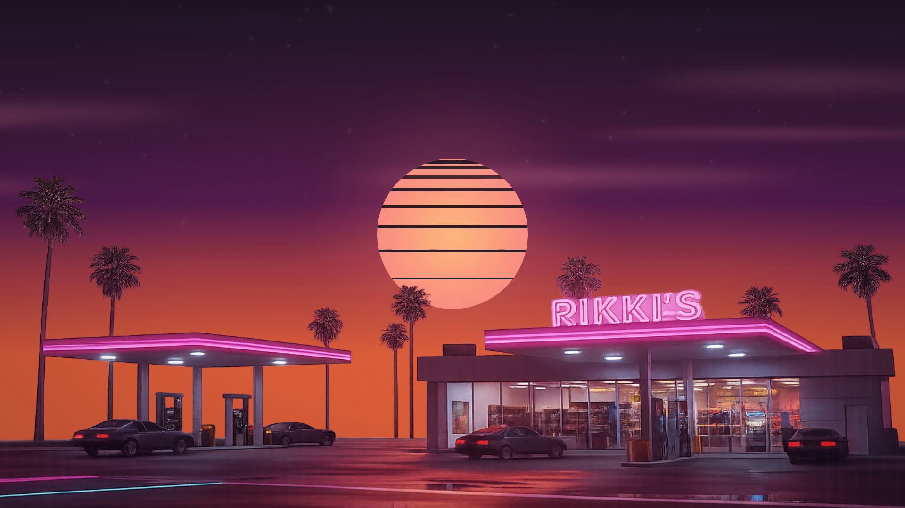

# Synthwave Sunset Animation



An animated 80s synthwave-style video background built with [Remotion](https://remotion.dev). Features a retro gas station scene with animated sky, descending striped sun, drifting clouds, and twinkling stars.

## Features

- **Synthwave Sun** - Classic striped/banded sun that descends to the horizon
- **Animated Sky** - Gradient transitions from warm sunset oranges to cool night purples
- **Wispy Clouds** - Stretched, atmospheric clouds drifting across the sky
- **Star Field** - 120 stars with individual twinkle animations, faint during day, bright at night
- **Color Grading** - Multi-layer filter system for cohesive synthwave aesthetic
- **Gas Station Foreground** - PNG overlay with transparent sky area

## Specs

| Property | Value |
|----------|-------|
| Duration | 3:43 (223 seconds) |
| Frames | 6690 @ 30fps |
| Resolution | 1920x1080 |
| Sunset | 2:20 (frame 4200) |

## Project Structure

```
src/remotion/
├── SynthwaveBackground.tsx   # Main composition with all animated layers
├── Root.tsx                  # Composition registration
├── DynamicComp.tsx           # Dynamic code compilation (unused for this project)
└── compiler.ts               # Babel compiler utilities

public/
└── gas-station.png           # Foreground image with transparent sky

assets/
├── gas-station.png           # Source image
└── preview.png               # README preview image
```

## Quick Start

```bash
# Install dependencies
npm install

# Open Remotion Studio to preview
npm run remotion

# Render final video
npm run render -- --composition=SynthwaveBackground
```

## Timeline

| Phase | Time | Frames | Description |
|-------|------|--------|-------------|
| Sunset | 0:00 - 2:20 | 0 - 4200 | Sun descends, warm orange/pink sky |
| Night | 2:20 - 3:43 | 4200 - 6690 | Stars brighten, cool purple/blue tones |

## Customization

Key constants in `SynthwaveBackground.tsx`:

```typescript
const DURATION_FRAMES = 6690;  // Total length
const SUNSET_FRAME = 4200;     // When sun hits horizon
const STAR_COUNT = 120;        // Number of stars
const CLOUD_COUNT = 8;         // Number of cloud wisps
```

### Color Palette

The synthwave aesthetic uses these color ranges:

- **Sky Sunset**: `#1A1A2E` (top) → `#4A1A5E` (mid) → `#FF6B35` (horizon)
- **Sky Night**: `#0D0D1A` (top) → `#1A1A3E` (mid) → `#2D1B4E` (horizon)
- **Sun**: Pastel yellow/pink gradient with `#1A1A2E` stripes

## Output

Rendered videos are saved to `out/SynthwaveBackground.mp4`

## License

Note that for some entities a Remotion company license is needed. [Read the terms here](https://github.com/remotion-dev/remotion/blob/main/LICENSE.md).
